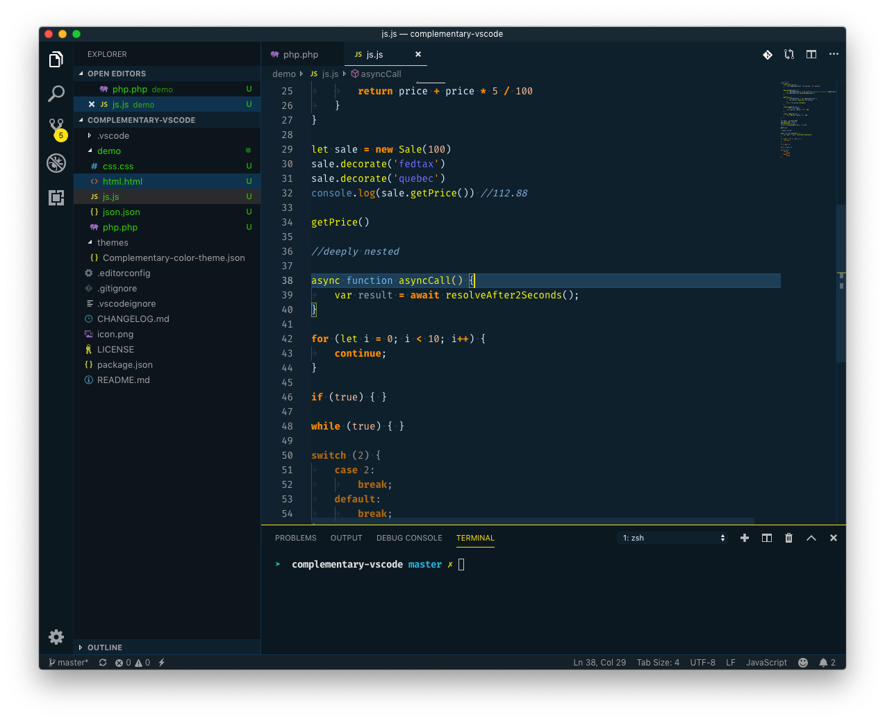
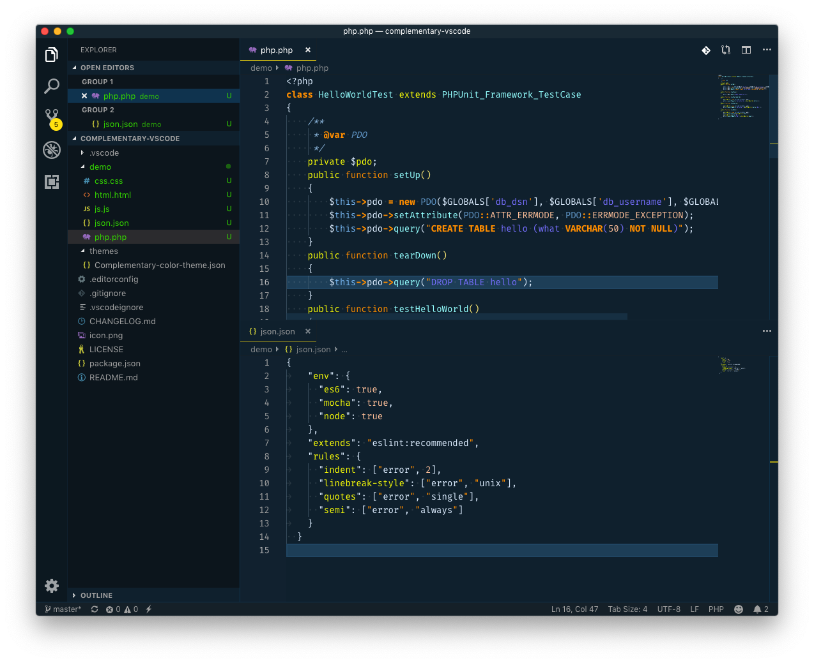

# Complementary Theme

💪 A dark blue-yellow-ish theme for focused programming.

## Installation

1.  Install [Visual Studio Code](https://code.visualstudio.com/)
2.  Launch Visual Studio Code
3.  Choose **Extensions** from menu
4.  Search for `complementary`
5.  Click **Install** to install it
6.  Click **Reload** to reload the Code
7.  From the menu bar click: Code > Preferences > Color Theme > **Complementary**

## Special thanks

A special thanks to [Sarah Drasner](https://twitter.com/sarah_edo) ans [Wes Bos](https://twitter.com/wesbos) for documenting their themes [Night Owl](https://github.com/sdras/night-owl-vscode-theme) and [Cobalt 2](https://github.com/wesbos/cobalt2-vscode) so thoroughly. Both themes saved as a starting point for me and made my work *a lot* easier.

OpenSource is just awesome, right? 😘
